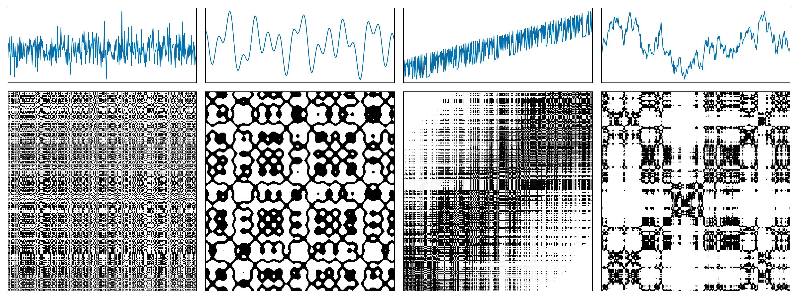
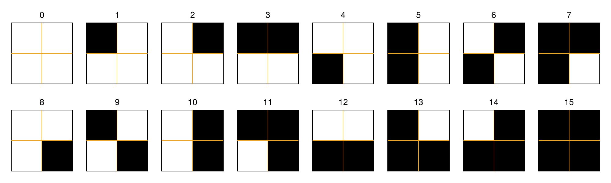

#   Distributions

In this section, we introduce the computation of Recurrence Microstates Analysis (RMA) distributions using [`RecurrenceMicrostatesAnalysis`](@ref).
We begin with a [Quick start with RecurrenceMicrostatesAnalysis.jl](@ref), which demonstrates a simple application example. Next, we present [A brief review](@ref) of Recurrence Plots (RP) and RMA.
Finally, we explain the [`distribution`](@ref) function in [Computing RMA distributions](@ref), describing how to use it, as well as the computation of [Histograms](@ref).

##  Quick start with RecurrenceMicrostatesAnalysis.jl

Here we present quick examples of how to use the package. To compute an RMA distribution, you need to use the [`distribution`](@ref) function, which returns a [`Probabilities`](@ref) struct containing the microstate distribution.

We start with a simple example by computing the distribution of a uniform random process. First, we generate the data and convert it into a [`StateSpaceSet`](@ref):
```@example quick_example
using Distributions, RecurrenceMicrostatesAnalysis
data = rand(Uniform(0, 1), 10_000);
ssset = StateSpaceSet(data)
```

Next, we use this [`StateSpaceSet`](@ref) as input to compute the distribuion. We also need to specify the threshold, $\varepsilon$, and the microstate length, $N$.
These parameters are explained in more detail in the sections [A brief review](@ref) and [Optimizing the threshold](@ref).

We will do here a "fast example about how to use the package". To compute a RMA distribution with the package you need to use the function [`distribution`](@ref), which will result in
a [`Probabilities`](@ref) struct containg the distribution of microstates.
```@example quick_example
ε = 0.27
N = 2
dist = distribution(ssset, ε, N)
```

As another example, we use the package [DynamicalSystems.jl](https://juliadynamics.github.io/DynamicalSystemsDocs.jl/dynamicalsystems/stable/).
Following the same Hénon map example presented in its documentation, we compute a trajectory as follows:
```@example quick_example
using DynamicalSystems

function henon_rule(u, p, n) # here `n` is "time", but we don't use it.
    x, y = u # system state
    a, b = p # system parameters
    xn = 1.0 - a*x^2 + y
    yn = b*x
    return SVector(xn, yn)
end

u0 = [0.2, 0.3]
p0 = [1.4, 0.3]

henon = DeterministicIteratedMap(henon_rule, u0, p0)

total_time = 10_000
X, t = trajectory(henon, total_time)
X
```

Finally, we compute the RMA distribution from the trajectory `X`. Here, we use the [`optimize`](@ref) function to determine an appropriate threshold by maximizing the recurrence entropy:
```@example quick_example
ε, S = optimize(Threshold(), RecurrenceEntropy(), X, N)
```

```@example quick_example
dist = distribution(X, ε, N)
```

##  A brief review

The concept of Recurrence Plots (RPs) was introduced in 1987 by Eckmann et al. [Eckmann1987RP](@cite) as a method for analyzing dynamical systems through recurrences.
Let a time series $\vec x_i \in \mathbb{R}^d$, $i \in \{1, 2, ..., K\}$ where $K$ is the length of the time series and $d$ is the dimension of the phase space (e.g., $d = 3$ for the Lorenz system).
The RP is defined as a graphical representation of the recurrence matrix
```math
R_{i,j} = \Theta(\varepsilon - \|\vec x_i - \vec x_j\|),
```
where $\Theta(\cdot)$ denotes the Heaviside step function and $\varepsilon$ is the threshold parameter that defines the maximum distance between two points for them to be considered $\varepsilon$-recurrent.

The following figure shows examples of recurrence plots for different systems:
(a) white noise;
(b) a superposition of harmonic oscillators;
(c) a logistic map, $x_{n+1} = 4x_n(1 - x_n)$, with a linear trend added in time, $y_n = x_n + \alpha n$;
(d) Brownian motion.



A recurrence microstate is a small local structure that can be identified within an RP. These structures form a closed set of microstates, determined by their shape and size.
For example, considering square microstates of length $N = 2$, there are $16$ possible microstates that can occur in an RP.



Recurrence Microstates Analysis (RMA) uses the probability distribution of these microstates within an RP as a source of information for the analysis. 
Accordingly, [`RecurrenceMicrostatesAnalysis`](@ref) computes these distributions and applies them to the study of dynamical systems.

##  Computing RMA distributions

The computation of RMA distributions is the core of the [`RecurrenceMicrostatesAnalysis`](@ref) package; all other functionalities rely on it as their primary source of information.
Therefore, understanding how this tool works is essential in order to fully use the package and all that it has to offer. 
RMA distributions are computed using the [`distribution`](@ref) function, which provides several parameters that control its behaviour.

```@docs
distribution
```

The package implements several aliases to simplify the usage of the [`distribution`](@ref) function. One of them was shown in the [Quick start with RecurrenceMicrostatesAnalysis.jl](@ref) section:
```julia
distribution([x], ε::Float, n::Int; kwargs...)
```

This method automatically uses a [`CPUCore`](@ref) when `[x]` is a [`StateSpaceSet`](@ref), or a [`GPUCore`](@ref) when `[x]` is an `AbstractGPUVector`. By default, it also uses `Square` microstates with side length `n`.

In addition to the keyword arguments of the default implementation, this method provides the following extra configurations:
- `rate::Float64`: sampling rate, with default value `0.05`.
- `sampling::SamplingMode`: sampling mode; see [Distribution sampling](@ref). The default is [`SRandom`](@ref).
- `metric::Metric`: metric used to compute recurrences, based on the package [Distances.jl](https://github.com/JuliaStats/Distances.jl). When using a [`GPUCore`](@ref), a [`GPUMetric`](@ref) must be used; see [Metrics for GPU](@ref).

!!! warning
    When using GPU backend, inputs must be of type `Float32`. The package is not compatible with `Float64` on GPU.

It is also possible to specify the [`RecurrenceExpression`](@ref) directly instead of providing the threshold explicitly:
```julia
distribution([x], expr::RecurrenceExpression, n::Int; kwargs...)
```

In this case, the keyword arguments remain the same, except for `metric`, which is already defined within the [`RecurrenceExpression`](@ref).

**Example:**
```@example quick_example
expr = Corridor(0.05, 0.27)
dist = distribution(ssset, expr, 2)
```

If a different [`MotifShape`](@ref) is desired, the function call can be simplified to:
```julia
distribution([x], shape::MotifShape; kwargs...)
```

Here, `shape` constains the information about both the [`RecurrenceExpression`](@ref) and the microstate size `n`.

**Example:**
```@example quick_example
shape = Triangle(Standard(0.27), 3)
dist = distribution(ssset, shape)
```

The package also provides implementations for computing RMA distributions from Cross-Recurrence Plots (CRPs). 
In this case, the workflow is similar, but two time series must be provided as input:
```julia
distribution([x], [y], expr::RecurrenceExpression, n::Int; kwargs...)
distribution([x], [y], expr::RecurrenceExpression, n::Int; kwargs...)
distribution([x], [y], shape::MotifShape; kwargs...)
```

**Example:**
```@example quick_example
data_1 = StateSpaceSet(rand(Uniform(0, 1), 1000))
data_2 = StateSpaceSet(rand(Uniform(0, 1), 2000))
dist = distribution(data_1, data_2, 0.27, 2)
```

!!! danger
    Note that `[x]` and `[y]` must have the same phase-space dimensionality. The following example is invalid because `data_1` has 2 dimensions while `data_2` has 3, which results in an exception:
    ```julia
    data_1 = StateSpaceSet(rand(Uniform(0, 1), (1000, 2)))
    data_2 = StateSpaceSet(rand(Uniform(0, 1), (2000, 3)))
    dist = distribution(data_1, data_2, 0.27, 2)
    ```

### Spatial data

[`RecurrenceMicrostatesAnalysis`](@ref) also provides support for spatial data, following the work *"Generalised Recurrence Plot Analysis for Spatial Data"* [Marwan2007Spatial](@cite).
This implementation represents an open research direction and is included in the package primarily for exploratory purposes.
For this reason, support for spatial data analysis is partial, as many of its theoretical aspects have not yet been fully developed.

In this context, the application interface is
```julia
distribution([x], shape::MotifShape; kwargs...)
```
which was introduced earlier. The implementation is the same, but here `[x]` is an `AbstractArray`.
The input data are defined as
```math
\vec{x}_{\vec i} \in \mathbb{R}^m, \vec{i} \in \mathbb{Z}^d.
```

Within the package context, this can be provided as, for example, $m = 2$, $d = 2$, and $\vec{i} \in [1, K]^d$ with $K = 50$:
```@example quick_example
spatialdata = rand(Uniform(0, 1), (2, 50, 50))
```

The resulting recurrence plot has dimension $2 \times d$, forming a tensorial structure that cannot be directly visualized and can be computationally demanding.
In this situation, the RMA distribution can be defined to avoid memory limitations, although the cost of increased complexity.
Specifically, the microstates may themselves become tensorial objects of dimension $2 \times d$, or projections onto lower-dimensional subspaces.
This bevaviour is specified through the [`MotifShape`](@ref).

**Example:**
- Microstate with $N = 2$ and full $2 \times d$ dimensionality:
```@example quick_example
distribution(spatialdata, Rect(Standard(0.27), (2, 2, 2, 2)))
```

- Microstate with $N = 2$ projected onto the first and third dimensions:
```@example quick_example
distribution(spatialdata, Rect(Standard(0.27), (2, 1, 2, 1)))
```

[`RecurrenceMicrostatesAnalysis`](@ref) also supports a spatial analogue of the Cross-Recurrence Plot (CRP) used for time series, referred to here as the Croos-Spatial Recurrence Plot (CSRP).
This functionality arises naturally from the package structure and can be invoked as
```julia
distribution([x], [y], shape::MotifShape; kwargs...)
```

**Example:**
- Microstate $N = 2$ and full $2\times d$ dimensionality:
```@example quick_example
spatialdata_1 = rand(Uniform(0, 1), (2, 50, 50))
spatialdata_2 = rand(Uniform(0, 1), (2, 25, 25))
distribution(spatialdata_1, spatialdata_2, Rect(Standard(0.27), (2, 2, 2, 2)))
```

- Microstate $N = 2$ projected onto the first and third dimensions:
```@example quick_example
distribution(spatialdata_1, spatialdata_2, Rect(Standard(0.27), (2, 1, 2, 1)))
```

##  Histograms
The [`histogram`](@ref) function is responsible for counting the occurrences of each microstate identified during the sampling process. 
It is internally called by the [`distribution`](@ref) function, which takes the resulting [`Counts`](@ref) and returns the corresponding [`Probabilities`](@ref).

This function is also responsible for implementing the backend.

```@docs
histogram
```